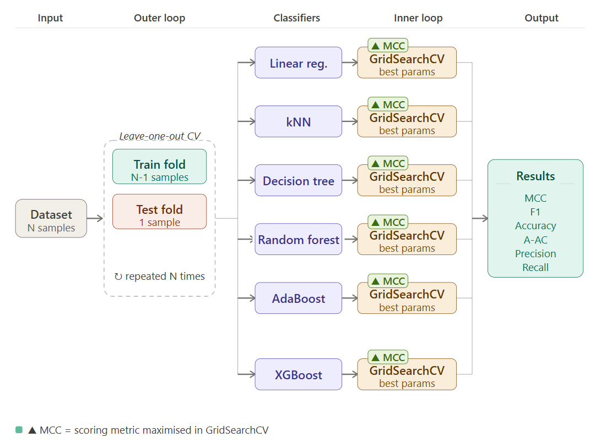

# Inteligencia Artificial para la Evaluación de la Enfermedad de Parkinson: un estudio experimental sobre finger tapping

## Descripción

Este repositorio es la implementación oficial de: (futuro enlace al artículo)


Aquí puede encontrar el código para realizar un estudio experimental utilizando vídeos de finger tapping. En las siguientes secciones, encontrará los pasos para configurar y utilizar el código presente en este repositorio.

## Dataset

El dataset de vídeos FIS está disponible en https://zenodo.org/records/17738775.

Este dataset contiene 234 grabaciones de vídeo de controles y pacientes (personas diagnosticadas con la enfermedad de Parkinson) realizando la prueba estandarizada de finger tapping, una evaluación motora comúnmente utilizada en entornos clínicos y de investigación. Los vídeos fueron recogidos como parte de un estudio colaborativo realizado por investigadores de la Universidad de Burgos y el Hospital Universitario de Burgos. Este trabajo fue apoyado por el proyecto PI19/00670 del Ministerio de Ciencia, Innovación y Universidades, Instituto de Salud Carlos III, España.

El dataset está destinado a apoyar la investigación sobre la caracterización de síntomas motores, métodos de evaluación cuantitativa y el desarrollo de herramientas de análisis automatizado para la enfermedad de Parkinson. Todas las grabaciones se obtuvieron siguiendo las aprobaciones éticas correspondientes, y los participantes proporcionaron su consentimiento informado para el uso de sus datos en investigación.

Se agradece a todos los participantes y a la Asociación de Enfermos de Parkinson su apoyo. Asimismo, agradecemos al Dr. Gamez Leiva y al Dr. Madrigal las evaluaciones de los vídeos.

La estructura del archivo zip es:

- `fis_diagnostic.csv`: Tabla con dos columnas, la primera es el nombre del vídeo y la segunda la calificación UPDRS para el clip.
- `videos/`: Carpeta con 234 vídeos (manos izquierda y derecha).

## Flujo de Trabajo de Clasificación

El siguiente diagrama ilustra el pipeline de validación cruzada anidada utilizado en este estudio para garantizar una evaluación robusta del modelo y el ajuste de hiperparámetros.



### 1. Datos de Entrada
El proceso comienza con el **Dataset original ($N$ muestras)**. Debido a la naturaleza de los datos, se emplea una estrategia de validación rigurosa para evitar el sobreajuste y proporcionar una estimación imparcial del rendimiento del modelo.

### 2. Bucle Externo: Validación Cruzada Leave-One-Out
Para maximizar el uso de los datos disponibles, se implementa un **Bucle Externo** utilizando **Leave-one-out CV**:
* **Pliegue de entrenamiento (Train fold):** Se utilizan $N-1$ muestras para el entrenamiento y la optimización de hiperparámetros.
* **Pliegue de prueba (Test fold):** Se reserva 1 muestra para la evaluación independiente.
* **Repetición:** Este ciclo se repite $N$ veces, asegurando que cada muestra del dataset se utilice como conjunto de prueba exactamente una vez.

### 3. Clasificadores y Bucle Interno (Ajuste de Hiperparámetros)
Para cada iteración del bucle externo, los datos de entrenamiento se pasan a seis algoritmos de clasificación diferentes:
* **Regresión Lineal**
* **k-Nearest Neighbors (kNN)**
* **Árbol de Decisión**
* **Random Forest**
* **AdaBoost**
* **XGBoost**.

Dentro del **Bucle Interno**, realizamos **GridSearchCV** para identificar los mejores parámetros para cada modelo. El proceso de optimización utiliza el **Coeficiente de Correlación de Matthews (MCC)** como la métrica principal a maximizar, garantizando un rendimiento equilibrado en todas las clases.

### 4. Salida y Métricas de Evaluación
Una vez determinados los modelos óptimos y probados contra las muestras reservadas, se agrega el rendimiento final. El pipeline genera un conjunto completo de métricas de evaluación:
* **MCC**
* **F1-Score**
* **Accuracy**
* **A-AC** (Acceptable Accuracy)
* **Precision**
* **Recall**

## Información del Código

Este código ha sido escrito en Python y se utiliza también un Jupyter Notebook para ejecutar el pipeline. En las secciones siguientes, puede encontrar los requisitos y cómo utilizar este código.

## Requisitos

En este proyecto puede encontrar tres archivos diferentes para recrear el entorno conda:

a) Para instalar solo los paquetes, ejecute:

```setup
conda create --name nuevo_entorno --file requirements.txt
```

b) Para importar el entorno completo, ejecute:

```setup
conda env create -f environment.yml
```

c) Para importar el entorno multiplataforma (recomendado para diferentes SO), ejecute:

```setup
conda env create -f environment_cross.yml
```

## Instrucciones de Uso

`notebooks\main.ipynb` proporciona instrucciones paso a paso para el procesamiento de datos.

a) En primer lugar, debe añadir su archivo de calificaciones UPDRS a la carpeta `input_files`. El nombre de este archivo debe ser `<dataset_identifier>_diagnostic.csv`. Este `<dataset_identifier>` debe ser el mismo que utilizará dentro del notebook principal `notebooks\main.ipynb`.

Este archivo debe contener dos columnas, llamadas *ID* y *UPDRS*, separadas por coma "*,*".
- *ID*: nombre de cada archivo de vídeo, sin extensión.
- *UPDRS*: calificación UPDRS por vídeo.
```csv  
ID,UPDRS
video1,0
video2,3
...
```

b) Por favor, revise `lib\config.py`. Las variables actuales se ajustan a la estructura de carpetas que se muestra en este proyecto.

c) Utilizando MediaPipe, la función `process_video` generará las series temporales de medidas cinemáticas base. Como resultado, se generan estos archivos:

- `output_files\<dataset_identifier>_time_series.csv`: series temporales de medidas cinemáticas base.
- `output_files\<dataset_identifier>_fps_videos.csv`: contiene los fps de cada vídeo.
- `log\<dataset_identifier>_frame_rate_processed_videos.csv`: para cada vídeo procesado con éxito, se muestra el porcentaje de fotogramas donde la mano se detectó correctamente.
- `log\<dataset_identifier>_frame_rate_rejected_videos.csv`: para cada vídeo rechazado, se muestra el porcentaje de fotogramas donde la mano se detectó correctamente. Estos vídeos se excluyen para los siguientes pasos.

d) La función `extract_all_features` extrae todas las características utilizando todos los enfoques (Clásico, TsFresh y FI+TsFresh). Como salida, se generan estos archivos:

- `output_files\<dataset_identifier>_classical_features.csv`.
- `output_files\<dataset_identifier>_tsfresh_features.csv`.
- `output_files\<dataset_identifier>_fi_tsfresh_features.csv`.

e) Finalmente, la función `classify_video` realiza el entrenamiento y la validación de los modelos de aprendizaje automático. Como entrada, se debe proporcionar el valor de `features_type`. Los valores aceptados son: *classical*, *tsfresh* y *fi_tsfresh*. Como resultado, se generan estos archivos:

- `log\<dataset_identifier>_<features_type>_execution.csv`: rastrea el progreso de la ejecución.
- `result_files\<dataset_identifier>_<features_type>_result.csv`: muestra un informe detallado de cada iteración.
- `result_files\<dataset_identifier>_<features_type>_execution_summary.csv`: este archivo proporciona un resumen del rendimiento de cada algoritmo y el resultado global para cada métrica evaluada.
- `result_files\confusion_matrix\<dataset_identifier>_<features_type>_cm_<ml_algorithm>.png`: matriz de confusión final para cada algoritmo evaluado.
- `result_files\roc_curves\<dataset_identifier>_<features_type>_roc_<ml_algorithm>.png`: curvas ROC para cada algoritmo evaluado.

## Referencias

Si utiliza este código en su investigación, por favor cite nuestro artículo:

```
Pendiente
```

---
[← Volver al README Principal](../README.md)
